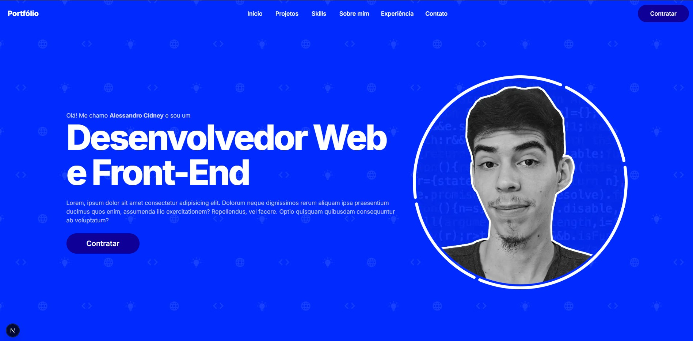

# My Portfolio Page
This project includes my portfolio page, showcasing projects I've worked on, personal projects, and some of my skills.



## Live Website
You can access the website at <https://www.linksdoale.com.br>

## How to Run the Website

### Package Installation
Make sure to install the dependencies using **npm** or an equivalent package manager.

> Note: This project was created with npm and includes a package-lock.json file. <br />
> If you prefer to use a different package manager, remove the package-lock.json file before running the install command.

To install the dependencies using npm, run the command:
```
npm install
```

### Environment Variables
After that, create a **.env** file and set up the environment variables as specified in the **.env.example** file.

### Run on Localhost
Finally, to run the project at <http://localhost:3000>, use the following command:
```
npm run dev
```

## How to build and deploy the website
This project was originally set up to be deployed on Vercel using the following commands from the Vercel CLI:

```
vercel

vercel --prod
```

However, you can also build the project using the command below and deploy it to your preferred environment:

```
npm run build
```